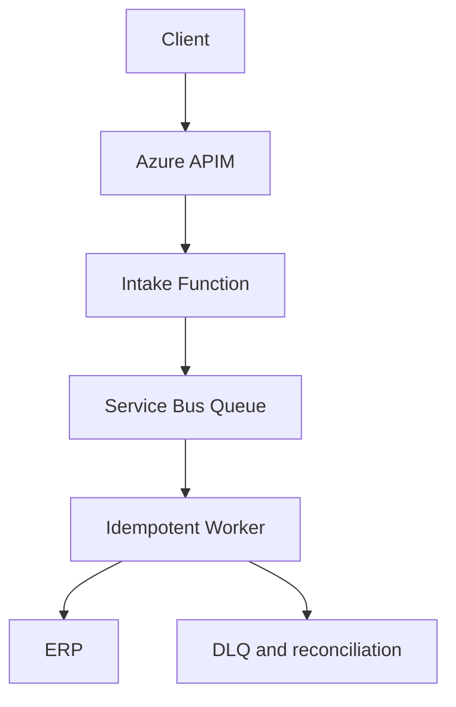

# Order processing — draft architecture

```mermaid
flowchart TD
 A[Client] --> B[Azure APIM]
 B --> C[Intake Function]
 C --> D[Service Bus Queue]
 D --> E[Idempotent Worker]
 E --> F[ERP]
 E --> G[DLQ and reconciliation]
```

Return HTTP 202 only after durable acceptance. This is a proposed design requiring manual review.